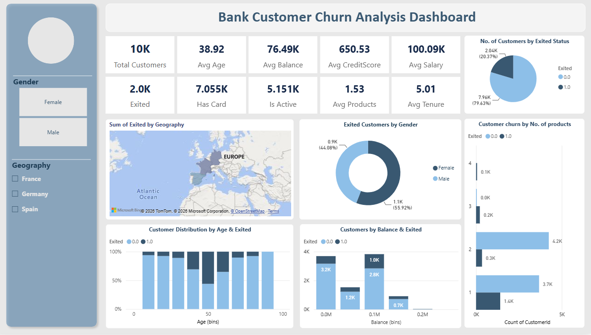

# 📉 Bank Customer Churn Analysis Dashboard

An interactive Power BI dashboard built to analyze customer churn using **10K customer records**. The project helps identify churn patterns across customer demographics, geography, account activity, and banking products to support data-driven business decisions.

## 🎯 Objective

To develop a Business Intelligence dashboard that enables stakeholders to monitor customer churn trends, analyze customer segments, and identify factors influencing customer retention.

## 🛠️ Tech Stack

 * Power BI
 * Microsoft Excel

## 📈 Features

 * Interactive KPI Dashboard
 * Customer Churn Analysis
 * Customer Segmentation
 * Demographic & Geographic Analysis
 * Banking Product Analysis
 * Dynamic Filters & Slicers
 * Interactive Visualizations

## 💡 Key Insights

 * Customer churn varied significantly across age groups, regions, and customer segments.
 * Customers with fewer products and inactive membership showed higher churn tendencies.
 * Customer segmentation helped identify key factors influencing churn.

## 🚀 Dashboard Preview

  

